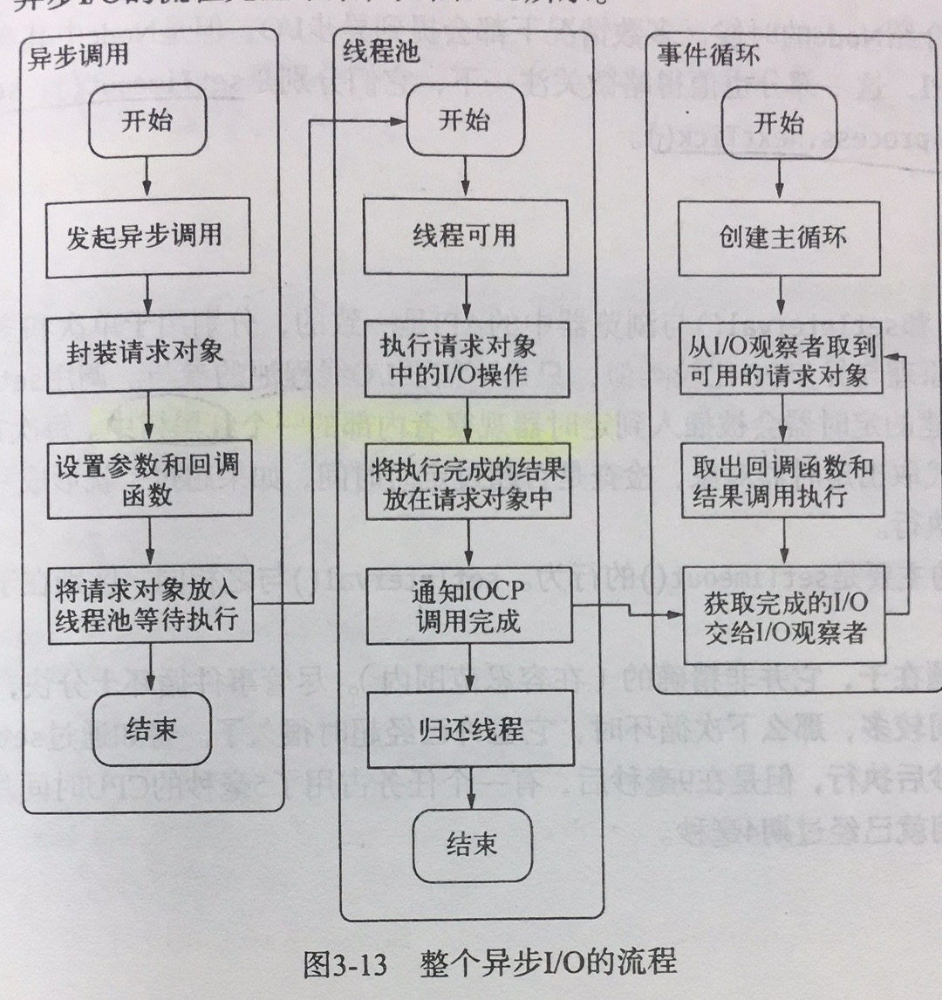

Node：异步IO，单线程，事件驱动
- 异步IO：资源的获取不会阻塞，第一个资源的获取不会阻塞第二个资源，这样我们就可以享受并发的优势
- 单线程：远离多线程死锁（当两个以上的运算单元，双方都在等待对方停止运行，以获取系统资源，但是没有一方提前退出时，就称为死锁）等问题。多线程创建线程和上下文切换开销比较大。

## 阻塞 IO 和非阻塞 IO
操作系统对于IO的形式：阻塞与非阻塞

###　阻塞IO
阻塞IO一定要等到系统内核层完成所有的操作后，调用才结束，会造成`CPU等待IO`，浪费时间，cpu处理能力得不到充分利用

### 非阻塞IO
非阻塞IO`调用后立即返回`（不带数据），主要通过`轮询`来检查IO是否完成。
- epoll：linux下效率最高的io事件通知机制，在进入轮询的时候如果没有检查到io事件，将会休眠，直到事件发生将它唤醒，不会浪费CPU，执行效率较高。
- read：反复`调用`来检查io状态，在最终得到数据前，cpu一直耗在等待上。
- select：read的改进，通过对`文件描述符`上的`事件状态`来进行判断，有个限制，它采用1024长的数组来存储状态，所以最多能够检查1024个文件描述符。
- poll：select的改进，采用链表的形式避免数组长度的限制。
- kqueue：类似于epoll，尽在FreeBSD下存在

以上方法对于应用程序来说依然是一种同步，cpu也会检查

## 异步IO
程序发起非阻塞调用，无需通过轮询或者事件唤醒等方式，可以直接处理下一个任务，只需在io完成后通过`信号`或`回调函数`将数据传递给程序即可，node则通过跨平台的`libuv库`完成异步io，现实中JavaScript执行在单线程中，而完成IO任务另有`线程池`。通过线程池和阻塞io完成异步io。

## 事件循环
node 的执行模型，正是它使回调函数十分普遍，事件循环是一个典型的生产者/消费者模型，网络请求，文件io源源不断产生事件.在进程启动时,node便会创建一个类似于 while(true)的循环,每执行一次循环成为一次Tick,每次Tick的过程就是查看是否有事件待处理.如果存在关联的回调函数,就执行他们,然后进入下个循环

### 异步经典调用方式
1. JavaScript调用Node的核心模块（即lib文件下的js模块）
2. 核心模块调用 C++ 内建模块
3. 内建模块通过 libuv 实现系统调用

### 异步io操作
1. 包装好好`请求对象`(JS层传入的`参数`和当前`方法`都被封装在这个请求对象中)，送入线程池等待执行
2. 线程池中的io操作调用完毕后，会将获取的结果存储在 req->result 属性上，然后通知iocp，告知当前对象操作已经完成。

调用图解;

## 非IO的异步API
- setTimeout(): 
- setInterval(): 创建的定时器会被插入到定时器观察者内部的一个红黑树中,每次Tick,会从该红黑树中迭代取出定时器对象,检查是否超过规定时间,如果超过,则形成一个事件,发的回调函数就会被立即执行,定时可能不准确
- setImmediate():回调函数会插入到下次事件循环的末尾,回调函数保存在`链表`中
- process.nextTick():将回调函数放入队列中,在下一轮tick立即取出,时间复杂度O(1),而采用`setTimeout(function() {}, 0)`事件复杂度为O(logn),回调函数保存在`数组`中,

process.nextTick() 优先级比 setImmediate()高.

## 事件驱动与高性能服务器
apache 使用每线程没请求,node使用事件驱动凡是处理请求,无需为每个请求创建一个线程,这样开销少,上下文切换代价低.

