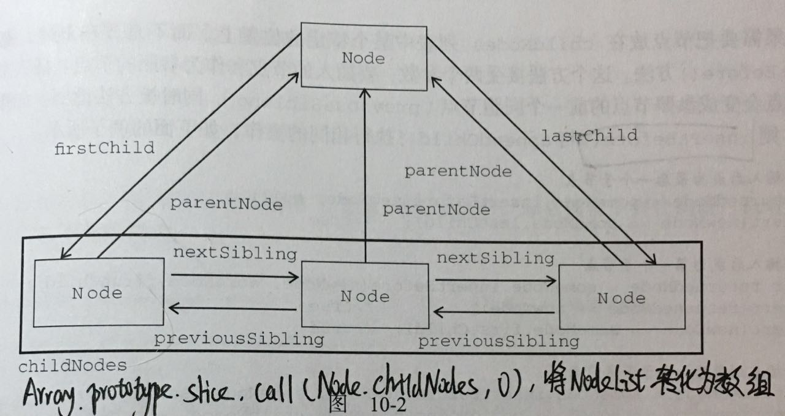

# DOM
DOM 是针对  HTML 和 XML 文档的一个 API ，DOM 绘制了一个层次化的节点树，允许开发人员添加、修改和移除页面的某一部分。


## 创建节点
```javascript
var script = document.createElement('script')
```

## 操作节点
### 添加节点
- `appendChild()`：向 childNodes 列表的末尾添加一个节点，返回新增的节点，如果节点已经存在了，则那个节点会首先从原先的位置移除，然后再插入新的位置。
- `insertBefore(newElement, referenceElement)`：在参照节点之前插入一个节点
```javascript
var child = parentElement.appendChild(child);
var insertedElement = parentElement.insertBefore(newElement, referenceElement);
```
## 移除节点
- `replaceChild(newChild, oldChild)`：用新节点替换当前节点的一个子节点,返回被替换的节点
- `removeChild()`:移除节点，返回被移除的节点
```javascript
var replacedNode = parentNode.replaceChild(newChild, oldChild);
let oldChild = parentNode.removeChild(child);
```
## 实例
动态加载 script，也可动态加载 css 
```javascript
var script = document.createElement('script');
script.src = 'url';
document.body.appendChild(script);
```
## 设置和获取属性
- `getAttribute()`： 获取属性的值
- `setAttribute()`：设置属性
```javascript
var title = div.getAttribute('title);
div.setAttribute('title', '标题');
```
## DOM 节点类型
- 元素节点： 例如 `<p>`、`<div>`，nodeType 等于 1
- 文本节点： 实际的文字，nodeType 等于 3
- 属性节点： nodeType 等于 2，DOM4 已弃用

## DOM 扩展
对 DOM 的两个主要的扩展是 选择符API 和 HTML5
### 选择符 API
- `querySelector()`：接受一个 CSS 选择符，返回与该模式匹配的`第一个`元素，若没找到，则返回 null
- `querySelectorAll()`：接受一个 CSS 选择符，返回所有符合要求的 NodeList
### HTML5
#### 与类相关的扩充
##### getElementsByClassName()
接受一个参数，即一个包含一个或多个类名的字符串，返回带有指定类的所有元素的 NodeList 
##### classList 属性
- add( String [, String] )：添加指定的类值。如果这些类已经存在于元素的属性中，那么它们将被忽略。
- remove( String [,String] )：删除指定的类值。
- item ( Number )：按集合中的索引返回类值。
- toggle ( String [, force] )：当只有一个参数时：切换 class value; 即如果类存在，则删除它并返回false，如果不存在，则添加它并返回true。当存在第二个参数时：如果第二个参数的计算结果为true，则添加指定的类值，如果计算结果为false，则删除它
- contains( String )：检查元素的类属性中是否存在指定的类值。

#### 焦点管理
在 HTML5 工作草案中，DOM 属性 activeElement 与方法 hasFocus() 为程序员提供了更好的控制页面交互的能力，特别是对于用户行为引发的交互。例如，它们都可以用于统计使用目的，跟踪页面特定链接的点击次数，计算元素获得焦点的次数等等。此外，当与 AJAX 技术结合以后，将会减少向服务器请求的数目，这取决于用户的活跃程度和页面的
