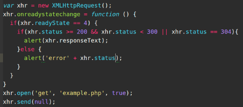
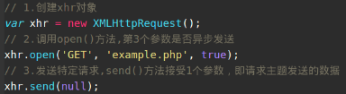
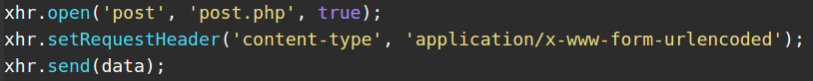

# ajax
## XMLHttpRequest 对象
### 完整例子代码

### 用法
请求必须是同一个域中使用相同`端口`和`协议`的url请求，3个步骤

在收到响应后，响应的数据会自动填充xhr对象的属性 
- responseText:响应主题被返回的文本 
- reponseXML：如果响应的内容是text/xml或application/xml，这个属性将保存响应的xml dom文档。 
- status:响应的HTTP状态码，200、304。。。 
- statusText:HTTP状态的说明

大多数情况下，我们还是发送异步请求，才能让JavaScript继续执行而不必等待响应，这时候就要检测XHR对象的readyState属性，该属性表示请求/响应过程的当前活动状态。这个属性取值如下： 
- 0：未初始化，尚未调用open()方法 
- 1：启动。已经调用open()方法，但未调用send方法。 
- 2：发送。已经调用send()方法，但尚未接受到响应。 
- 3：接收。已经接收到部分响应数据 
- 4：完成。已经接收到全部响应数据，并且可以在客户端使用了 
只要readyState属性的值有一个值变为另一个值，都会触发一次`readystatechange`事件 

使用setRequestHeader()方法可以设置自定义的请求头部信息 
例如 发送表单的值

