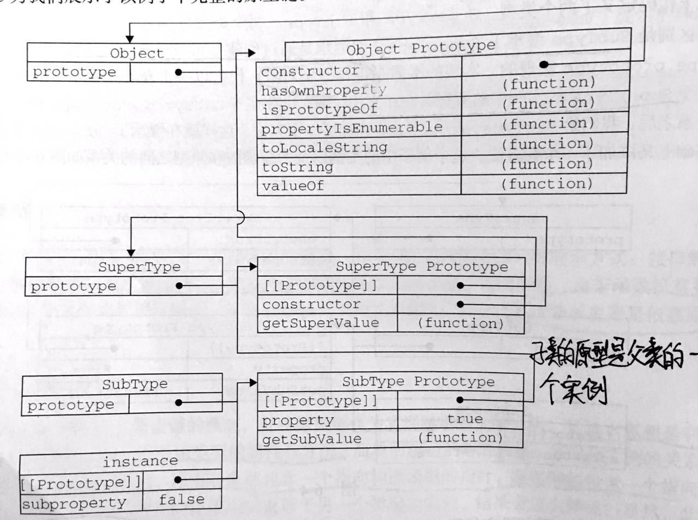

# 原型
我们创建的每个函数都有一个 `prototype` 原型属性，这个属性是一个`指针`，指向一个`对象`，这个对象的用途是包含可以由特定类型的`所有实例共享的属性和方法`。使用原型对象的好处是让所有对象实例共享包含的属性和方法。
```javascript
function Person() {
}
Person.prototype.name = "songsong";
Person.prototype.age = 21;
Person.prototype.sayName = function() {
    console.log(this.name);
}
let p1 = new Person();
let p2 = new Person();
p1.sayName(); // songsong
p2.sayName(); // songsong
```

## 原型对象


只要创建了一个函数，就会为该函数创建一个 `prototype` 属性，这个属性`指向函数的原型对象`（一般是 Object ）。默认情况下，所有原型对象都会自动获得一个 `constructor` (构造函数属性），这个属性包含一个指针，指向 `prototype` 属性所在的函数。

一些方法
- `isPrototypeOf()` : `Person.prototype.isPrototypeOf(p1)`
- `object.getPrototypeOf(p1)` :  `Object.getPrototypeOf(p1) == Person.prototype`

每行代码读取对象的某个属性时，都会执行一次搜索，目标是具有给定名字的属性，搜索首先从对象实例本身开始，如果找到则返回，没有找到的话则搜索指针指向的原型对象。`不能通过对象实例重写原型中的值，如果属性同名的话，则会屏蔽原型中的那个属性`，使用 `delete` 可以完全删除实例属性，从而让我们可以重新访问原型中的属性。

一些方法
- `hasOwnProperty()`: 给定属性存在于对象实例中才会返回 true

`in` 操作符：`"name" in p1`在单独使用时,无论属性存在于实例还是原型中，都会返回 `true`
```javascript
// 可以通过hasOwnProperty()和in来判断属性存在与对象中还是存在于原型中
function hasPrototypeProperty(object, name) {
    return !object.hasOwnProperty(name) && (name in object);
}
// 只有存在于实例中才返回 true ，
```

### 更简单的原型语法
用字面量
```javascript
function Person() {

}
// let p1 = new Person(); 不能写在前面,这样会切断构造函数和最初原型之间的联系
Person.prototype = {
    // constructor: Person, 可以这样设置，若不设置constructor 属性指向Object构造函数
    name: "songsong",
    age: 21,
    sayName: function() {
        console.log(this.name);
    }
}
let p1 = new Person();
p1.sayName();
```
`实例中的指针仅指向原型，而不指向构造函数`

组合使用构造函数模式和原型模式
```javascript
// 定义实例属性
function Person(name, age, job) {
    this.name = name;
    this.age = age;
    this.job = job;
}
// 定义共享的方法和属性
Person.prototype = {
    constructor: Person,
    sayName: function() {
        console.log(this.name);
    }
}
let p1 = new Person('songsong', 21, 'frontend');
let p2 = new Person('song', 21, 'backend');
p1.sayName(); // songsong
p2.sayName(); // song
```

## 继承
实现继承主要是依靠原型链，让子类的原型等于父类的实例

### 原型链继承
一般不采用
```javascript
function SuperType() {
    this.superValue = true;
}
SuperType.prototype.getSuperValue = function() {
    return this.superValue;
}

function SubType() {
    this.subValue = false;
}
SubType.prototype = new SuperType(); // 让子类的原型等于父类的实例
SubType.prototype.getSubValue = function() {
    return this.subValue;
} // 注意不能使用字面量创建原型，这样做的话会重写整个原型链
let s = new SubType();
console.log(s.getSuperValue());

```
示意图


确定原型和实例的关系
- `instanceof` : `instance instanceof Object`
- `isPrototypeOf()`: `Object.prototype.isPrototypeOf(instance)` 

### 原型链继承的问题
- 包含引用类型值的原型属性会被所有实例共享
- 在创建子类型实例时，不能向超类型的构造函数中传递参数

### 借用结构函数
在子类构造函数的内部调用超类型构造函数
```javascript
function SuperType() {
    this.colors = ['red', 'blue'];
}

function SubType() {
    SuperType.call(this)
    // SubType.call(this, "songsong") 可以向超类传递参数
}
let instance1 = new SubType();
instance1.colors.push('black');
console.log(instance1.colors) // [ 'red', 'blue', 'black' ]
let instance2 = new SubType();
console.log(instance2.colors); // [ 'red', 'blue' ]
// 如果使用了原型继承，两个输出的结构一样
```

## 组合继承
最常用的继承模式，将原型链和借用构造函数的技术组合在一起。方法是：使用原型链对原型属性和方法的继承，通过构造函数实现对实例属性的继承
```javascript
function SuperType(name) {
    this.name = name;
    this.colors = ['red', 'blue'];
}
SuperType.prototype.sayName = function() {
    console.log(this.name);
}

function SubType(name, age) {
    SuperType.call(this, name);
    this.age = age;
}
SubType.prototype = new SuperType();
SubType.prototype.constructor = SubType;
SubType.prototype.sayAge = function() {
    console.log(this.age);
}
let instance1 = new SubType('songsong', 21);
instance1.colors.push('black');
console.log(instance1.colors);
instance1.sayName();
instance1.sayAge()
let instance2 = new SubType('song', 18);
console.log(instance2.colors);
instance2.sayName();
instance2.sayAge();
/** 
 * [ 'red', 'blue', 'black' ]
 * songsong
 * 21
 * [ 'red', 'blue' ]
 * song
 * 18 
 * */
```