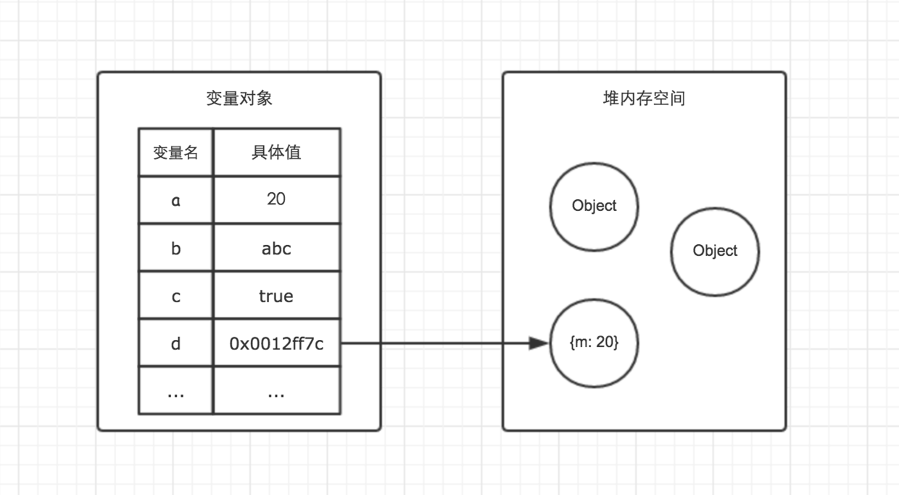

# 基本类型和引用类型
示意图

## 基本类型
基本类型值指的是简单的数据段，按值访问，可以操作保存在变量中的实际的值，JavaScript基本类型有
- Number
- String
- Null
- Undefined
- Boolean
- Symbol(es6)

## 引用类型
引用类型的值是保存在内存中的对象，例如`Array`, `object`。对于引用类型的值，我们可以动态的添加或删除属性和方法，基本类型则不能。
当我们复制引用类型的值时，复制的其实使他的指针，这个指针指向堆内存中的同一个对象，改变其中一个变量就会影响另外一个变量。

## 传递参数
JavaScript所有函数的参数都是按值传递的，没有引用传递
- 传递基本类型的值时，被传递的值会被复制给一个局部变量（arguments对象中的一个元素），这个值的变化不会反应在函数外部
- 传递引用类型的值时，这个值在内存中的地址会复制给一个局部变量，这个局部变量的变化会反应在函数外部。
