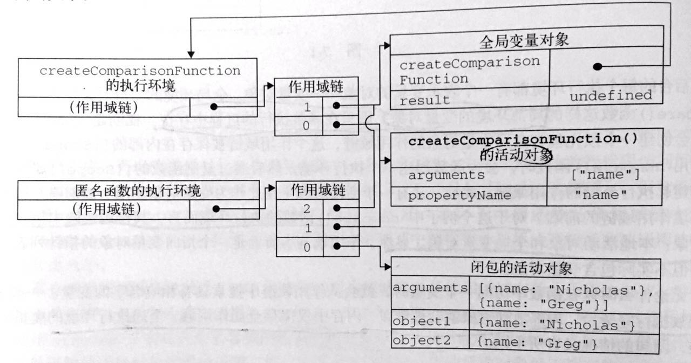

# 闭包
## 闭包概念
闭包是一个`函数`，这个函数有权`访问`另外一个函数作用域中的`变量`。闭包可以记忆它被创建时候的环境，这样它就可以访问环境中的变量了。闭包是一种特殊的对象，由`函数`，以及`创建该函数的环境`组成，环境由闭包创建时在作用域中的任何局部变量组成。

## 闭包用途
- 可以读取函数内部中的变量
- 让这些变量的值始终保存在内存中

## 代码示例
```javascript
function a() {
    let n = 2;

    function b() {
        console.log(n);
    }
    return b;
}
let c = a();
c(); // 输出 2
```
## 另一个例子
```javascript
function makeAdd(x) {
    return function(y) {
        return x + y;
    }
}
let makeAdd2 = makeAdd(2);
let makeAdd3 = makeAdd(3);
console.log(makeAdd2(10)); // 12
console.log(makeAdd3(10)); // 13
```
makeAdd2, makeAdd3 都是闭包，享有共同的函数定义，但是保存了不同的环境。


```javascript
// 容易混淆的
function a() {
    var result = [];
    for (var i = 0; i < 10; i++) {
        result[i] = function() {
            return i;
        }
    }
    return result;
}
console.log(a()[1]()); // 10 ，所有的输出都是10
10

function b() {
    let result = [];
    for (let i = 0; i < 10; i++) {
        result[i] = function() {
            return i;
        }
    }
    return result;
}
console.log(b()[1]()); // 0 1 2 3 4 5 。。。

function c() {
    let result = [];
    for (let i = 0; i < 10; i++) {
        result[i] = i;
    }
    return result;
}
console.log(c()); // [ 0, 1, 2, 3, 4, 5, 6, 7, 8, 9 ]

function d() {
    var result = [];
    for (var i = 0; i < 10; i++) {
        result[i] = i;
    }
    return result;
}
console.log(d()); // [ 0, 1, 2, 3, 4, 5, 6, 7, 8, 9 ]
```

## 循环和闭包
```javascript
for (var i = 0; i < 10; i++) {
    (function(j) {
        setTimeout(function() {
            console.log(j); // 每隔1s输出1,2,3...
        }, j * 1000);
    })(i);
} 
```